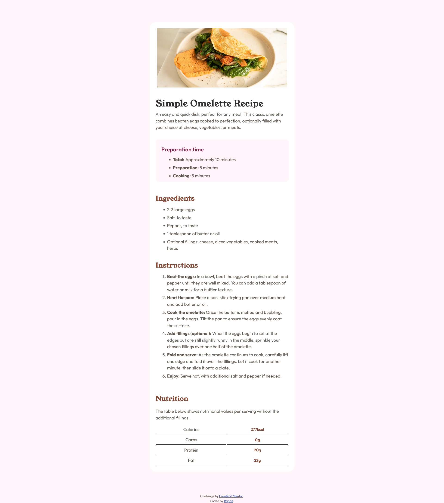

# Frontend Mentor - Recipe page solution

This is a solution to the [Recipe page challenge on Frontend Mentor](https://www.frontendmentor.io/challenges/recipe-page-KiTsR8QQKm). Frontend Mentor challenges help you improve your coding skills by building realistic projects. 

## Table of contents

- [Overview](#overview)
  - [The challenge](#the-challenge)
  - [Screenshot](#screenshot)
  - [Links](#links)

## Overview

### Screenshot

### Links

- Solution URL: [Add solution URL here](https://github.com/Rapbit27/04_Recipe_Page)
- Live Site URL: [Add live site URL here](https://rapbit27.github.io/04_Recipe_Page/)

